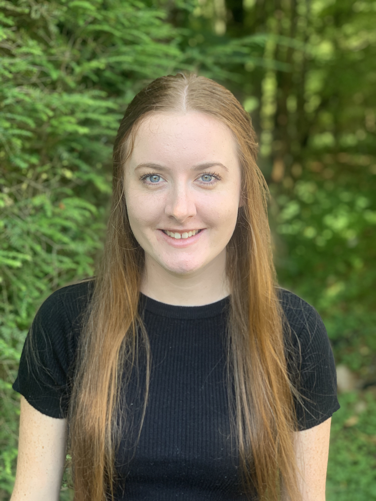

# Ciara Fogarty

###### 6824 Salem Quarter Rd. Belews Creek, NC 27009
###### (336)529-8626
###### fogartycb@appstate.edu
###### [My Linkedin](linkedin.com/in/ciara-fogarty-65307619a)

## Summary
----------
I am a currently a senior at Appalachian State University.  I pursuing a BS degree in Geography with a concetration in GIS.  I am a student who has a good work ethic and is punctual.  I am detailed oriented and I am a team player.

## Education
---------
* Appalachian State University, Boone, NC, USA- BS in Geography with a GIS concentration.
-*Expected graduation date: August 2021*
-*Current GPA: 3.37*

* University College Cork, Ireland- Study abroad program
-*September 2019-May 2020*

## Skills
---------
* Microsoft Word
* Microsoft Excel
* Microsoft Powerpoint
* ArcGIS
* Adobe Illustrator
* R
* R Studio
* Landviewer

## Awards
---------
* Deans List 2017-2019
* National Honors Society 2015-2017

## Activities
---------
* Child Advocacy Club 2017-2018
* App State Club Cheer 2018-2019
* UCC Kickboxing Club 2019-2020

## Work Experience
---------
* The Loop, Kernersville, NC- *Front of House*
February 2016-August 2019
  * Looked for ways to serve without direction and regularly pitched in by cleaning up and organizing the front area, replenishing condiments and napkins and bussing during busy times.
  * Memorized menu and offered discerning recommendations, remained steps ahead of patrons' needs and desires and accurately gauged level of interest in conversation and small talk.
* The Downtown School, Winston Salem, NC- *Class Intern*
September 2015-May 2017
    * Provided students with personalized educational, behavioral and emotional support.
    * Performed diverse tasks for teachers, including clerical support, classroom management and document coordination.
    * Graded assignments and tests using answer key, documented results and informed lead teacher of students' performance.
    * Kept students safe in classroom and outside environments.
